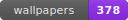

  

# Wallpaper Gallery  

A **static gallery site** to browse, preview, and download wallpapers stored in the repository's `wallpapers/` folder.

Just go to the website, choose and download your wallpapers.

If you want to **add wallpapers**, fork the repository --> add wallpapers --> open pull request.

  

## Scripts

#### Run `build_all.py` to automatically generate `thumbnails` & `json`.

Or use the following Python scripts included in the repository (use in order) :

| Script               | Description                               |
| -------------------- | ----------------------------------------- |
| `generate_thumbs.py` | Generate `thumbnails` for all wallpapers. |
| `generate_json.py`   | Generate `json` for all wallpapers.       |
| `add_favorites.py`   | Add a wallpaper to favorites list.        |

## Note

> **Disclaimer:** None of the wallpapers included are owned by me. They are collected from other sites. I have no way of knowing if there is a copyright on these images. If you find any of the image hosted here is yours and of limited use, please let me know and i will remove it.

Enjoy your wallpapers!
